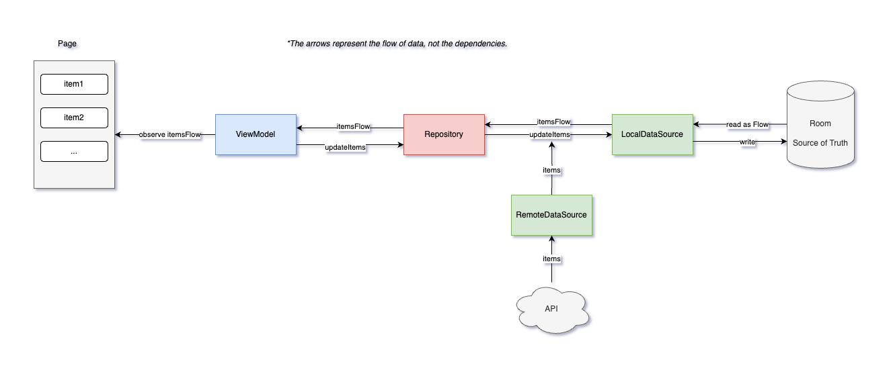

# Android Technical Assessment

# Overview
This is a native Android app of a Tech Assessment!

This project presents a simplified version of a forum which consists of a post list screen and a comment list screen.

# Features
- Display post list
- Display comment list
- Search posts and comments
- Refresh posts and comments
- Offline browsing
- Light/Dark Mode
- Loading and Error Handling

# Tech Stack
- **Architecture**: MVVM
- **UI Tool**: [Jetpack Compose](https://developer.android.com/jetpack/compose)
- **Dependency Injection**: [Hilt](https://developer.android.com/training/dependency-injection/hilt-android)
- **Testing**: [JUnit4](https://junit.org/junit4/), [Mockk](https://mockk.io/), [Kotest](https://kotest.io/), [Turbine](https://github.com/cashapp/turbine)
- **Data Persistence**: [Room](https://developer.android.com/training/data-storage/room)
- **Networking**: [Ktor](https://ktor.io/)

# Single Source of Truth
In this app, both the posts page and the comments page use the local database (Room) as the Single Source of Truth. The following diagram illustrates how it works:

